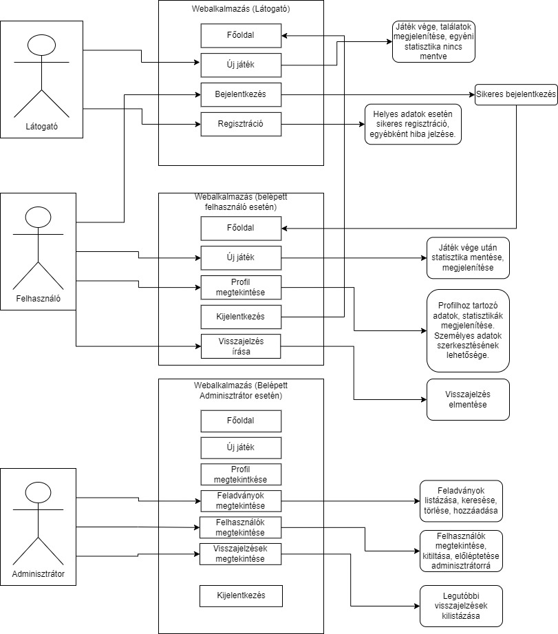
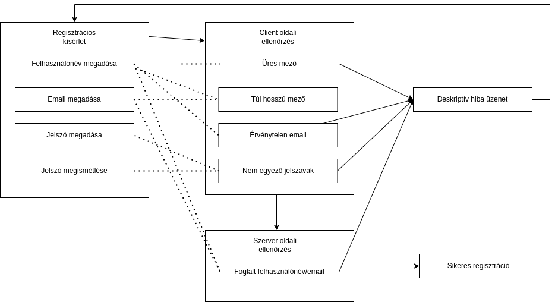
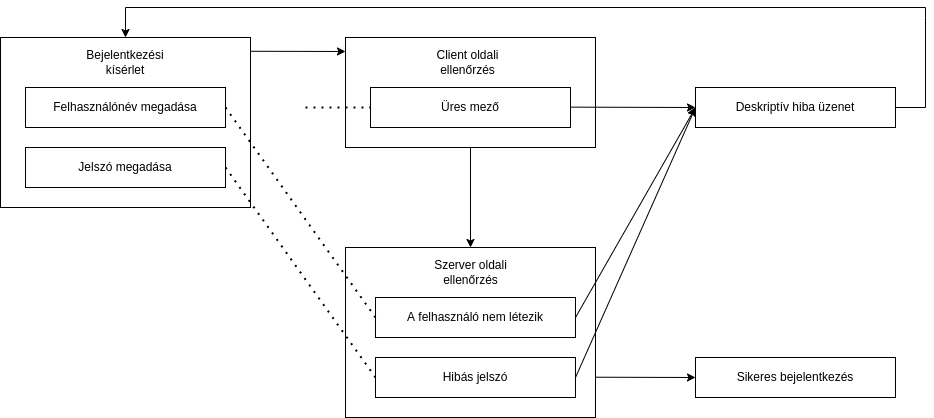
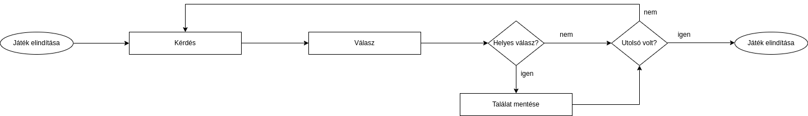

# Funkcionális specifikáció
## 1. Jelenlegi helyzet leírása
Ügyfelünk videójáték médiával foglalkozik. Több az iparról szóló hírportálért és blogért felelős.
Több médiumon gyűjt statisztikát a játékosok véleményeiről és tudásáról. Oldalain ösztönzi a felhasználói vélemény nyilvánítást. Rendelkezik automatizált kör email kiküldő és feldolgozó rendszerrel. Minden jelentős gamer rendezvényen állít standot és alkalmaz ügynököket személyes vélemény kikérésre. Ezeket az adatokat piacfelmérési szándékkal halmozza.
Bár módszereik nem hatástalanok, de lazán strukturáltak és közel nem olyan hatékonyak mint egy jól reklámozható centralizált felület.
Ezért bízott meg minket egy gaming témájú kvíz játék elkészítésével.

## 2. Vágyállomrendszer leírása
Egy webes felület ami idális a felhasználói számára videójátékos ismereteik tovább fejlesztésére.
Az oldalon grafikus kvízek kitöltésére nyílik lehetőség, melyekben a videójátékok képről való felismerése a cél. A játékos N mennyiségű kép-játéknév kombinációból álló _feladványt_ kap, ahol számára csak a kép látható ameddig nem helyez le egy tippet a játék címéről, minek hatására a helyes válasz láthatóvá válik.
Minden parti statisztikája a játék körülményeivel egyetemben rögzítésre kerül. Így pontos kép fog kialakulni minden felhasználó egyéni képpeségeiről és egy-egy _feladvány_ nehézségéről Ezekhez az információkhoz a _látogatók_ intuitív módon férhetnek hozzá.
Egy számítógép és aktív internet kapcsolat birtokában bárki játszhat, a részvétel nem meghíváshoz vagy regisztrációhoz kötött. Viszont az utóbbira van lehetőség. Minden regisztrált felhasználó előzményeit külön kezeljük ezzel lehetőséget adva a pontos, személyre szabott adatelemzés nyújtására. Továbbá feliratkozás után a felhasználók képesek lesznek visszajelzéseket írni az _adminoknak_.
Az _adminok_ különleges hatáskörrel rendelkező felhasználók. Ők tudnak módosítani bármely felhasználó és _feladvány_ adatain és új feladványokat hozzáadni. Számukra elérhető egy felhasználói visszajelzés lista is, amin kiemelve szerepelnek a még olvasatlan üzenetek.

## 3. Jelenlegi üzleti folyamatok modellje
Az ügyfél megbízott minket egy videójáték felismerő kvíz oldal elkészítésével.
A rendszer forrása az ügyfelet fogja illetni. Igényt képez annak további bővítési lehetőségével. Elvárás kód bázis könnyű újra fel használása, alapként használása.
Működtetni nélkülünk fogják az oldalt. A cég programozói háttérel nem rendelkező személyeket tervez kinevezni karbantartási és moderálási pozíciókra. Tervezés és kivitelezéskor ez kulcs fontosságó szempont. Minden felmerülhető CRUD műveletre grafikus felületet kell biztosítanunk.
Az oldal adatbányászási céllal jön létre, tehát egy szakszerű, normál formáknak eleget tevő adatbázis szükséges.
A projektre 3 hónap áll rendelkezésre.

## 4. Igényelt üzleti folyamatok modellje

## 5. Követelménylista
| Id | Modul | Név | Leírás |
| :---: | --- | --- | --- |
| K1 | Bejelentkezés | Bejelentkezési lap | Bejelentkező felület |
| K2 | Regisztráció | Regisztrációs lap |Regisztrációs felület látogatóknak. |
| K3 | Új játék indítása | *Új játék indítása* oldal | Új játék indítására és lejátszására szolgáló weblap |
| K4 | Saját profil megtekintése | *Profilom* oldal | Saját adatok megtekintése, szerkesztése, statisztikák megtekintése. |
| K5 | Feladványok megtekintése | *Feladványaim* lap | Feladványok kilistázása, törlése adminisztrátorok számára |
| K6 | Új feladvány feltöltése | *Feladvány létrehozása/hozzáadása* oldal | Új feladványok hozzáadása. Csak az adminisztrátor férhessen hozzá! |
| K7 | Visszajelzés | *Visszajelzés küldése* lap | Felhasználók számára visszajelzés írása. |
| K8 | Felhasználók megtekintése | *Felhasználók kilistázása* lap | Felhasználók kezelése adminisztrátorként. |

## 6. Használati esetek
1. Egy látogató az oldalra téved, hogy kis kisidőre szórakoztassa magát. Játszik egyet-kettőt majd kilép.
2. Egy videójátékokban méllyen érdekelt személy szeretné felmérni ismereteinek minőséget.
3. Egy látogató szeretne tudomást szerezni arról milyen videójátékokat nem ismer még, hogy ötletet kapjon arról mit lenne érdemes kipróbálnia.
4. Egy moderátor meg akarja tudni mit gondolnak a felhasználók a kvízekről.
5. Egy moderátor relevánsan akarja tartani az oldalt ezért új kvízt ad hozzá
6. Egy moderátor szerkesztene egy felhasználó fiókot (például mert problémás adatokat tartalmaz)

## 7. Megfeleltetés, hogyan fedik le a használati eseteket a követelményeket
| Lefedett használati eset | Követelmény | Követelmény azonosító(k) |
| :---: | :---: | :---: |
| 1. | minden látogató játszhat | K3 |
| 2. | regisztrált felhasználók áttekinthetik a statisztikáikat | K1, K2, K4 |
| 3. | regisztrált felhasználók tudhatják mit oldottak már meg, újjakat kereshetnek | K1, K2, K5 |
| 4. | moderátorok olvashatnak visszajelzéseket | K1, K2, K7 |
| 5. | moderátorok új feladványokat tölthetnek fel | K1, K2, K6 |
| 6. | moderátorok szerkeszthetnek felhasználói fiókokat | K1, K2, K8 |

## 8. Képernyőtervek

## 9. Forgatókönyvek
1. Regisztráció

2. Bejelentkezés

3. Játék

## 10. Funkció - követelmény megfeleltetése

| Id | Követelmény | Funkció |
| :---: | --- | --- |
| I1 |  K1 | F1 |
| I2 |  K1 | F2 |
| I3 |  K1 | F3 |
| I4 |  K2 | F4 |
| I5 |  K2 | F5 |
| I6 |  K2 | F6 |
| I7 |  K3 | F8 |
| I8 |  K4 | F10 |
| I9 |  K5 | F12 |
| I10 | K6 | F9 |
| I12 | K7 | F13 |
| I14 | K7 | F14 |
| I15 | K7 | F15 |
| I15 | K8 | F11 |
| I16 | N/A | F7 |

## 11 Fogalomszótár
+ **profil**: az oldalon való személyazonosság hitelesítéshez szükséges adat halmaz.
    * részei:
        - felhasználó név
        - email cím
        - jelszó
        - jogkör
		- elérhetőség (bannolva van-e?)
		- előző játékok
+ **látogató**: olyan fogyasztó aki nem rendelkezik felhasználói fiókkal.
+ **jogkör**: egy felhasználható álltal végre hajtható műveletek halmaza.
    * fajtái:
        - látogatói: játék
        - felhasználói: játék (rögzítettve); értékelés írás
        - moderátori: felhasználó; feladvány hozzáadás; felhasználók módosítása; hozzáféres az értékelésekhez
+ **IP**: "Intellectual Property"; Szellemi Tulajdon
