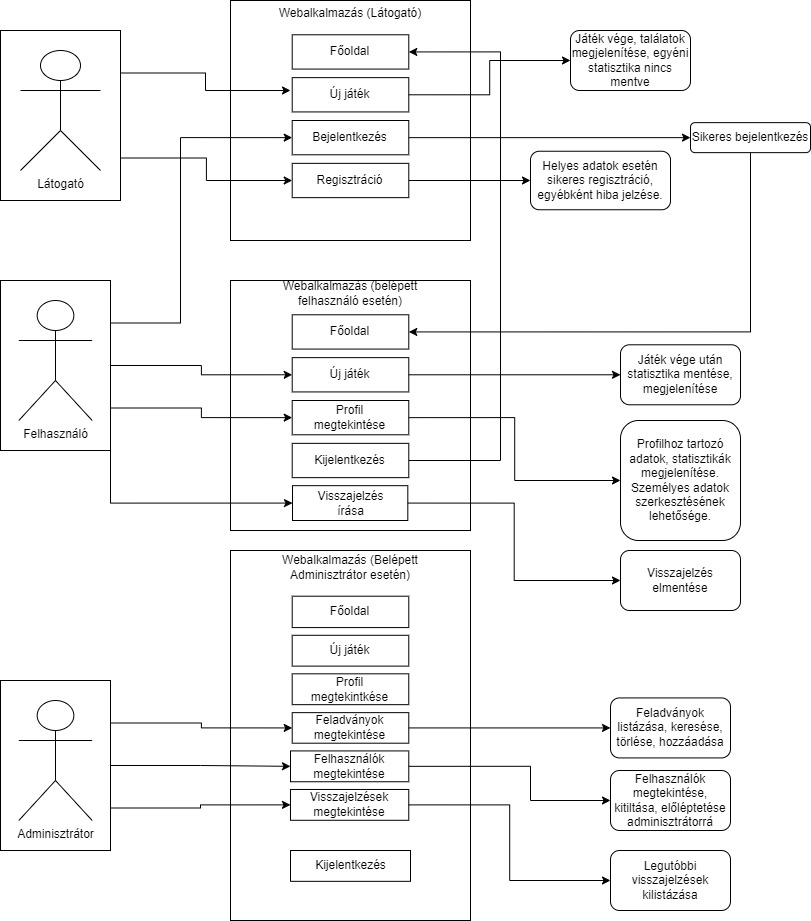

# Követelmény specifikáció

## 1. Áttekintés

    Manapság a videójátékok is egy fontos részét képezik a szórakoztatótiparnak. 
    A '80-as/'90-es évek idején nem igazán lehetett elképzelni, hogy a filmipar mellett a videójáték-ipar is fog annyira fejlődni, hogy napjainkban nemcsak a filmeknek, hanem a játékoknak történeteiből/meghatározó jeleneteiből is készülhetnek mindenféle tudást ellenörző kérdéssorok, quiz-ek, szellemi játékok, vetélkedők; kritikák; esetlegesen mémek is.

## 2. A jelenlegi helyzet leírása

## 3. Vágyálomrendszer

## 4. Jelenlegi üzleti folyamatok modellje

## 5. Igényelt üzleti folyamatok modellje

## 6. Követelménylista

| Id | Modul | Név | Leírás |
| :---: | --- | --- | --- |
| K1 | Bejelentkezés | Bejelentkezési lap | Bejelentkező felület |
| K2 | Regisztráció | Regisztrációs lap |Regisztrációs felület látogatóknak |
| K3 | Új játék indítása | *Új játék indítása* oldal | Új játék indítására és lejátszására szolgáló oldal |
| K4 | Saját profil megtekintése | *Profilom* oldal | Saját adatok és statisztikák megtekintése, személyes adatok szerkesztése |
| K5 | Feladványok megtekintése | *Feladványaim* lap | Adminisztrátorok számára feladványok listázása, azok törlése |
| K6 | Új feladvány feltöltése | *Feladvány létrehozása/hozzáadása* oldal | Adminisztrátorok számára új feladványok feltöltése |
| K7 | Visszajelzés | *Visszajelzés küldése* lap | Felhasználók számára visszajelzés írása, adminisztrátorok számára ezek megtekintése |
| K8 | Felhasználók megtekintése | *Felhasználók kilistázása* lap | Adminisztrátorok számára felhasználók megtekintése, keresése, lehetőség a felhasználók kitiltására, adminisztrátorrá való előléptetésére |

## 7. Fogalomtár