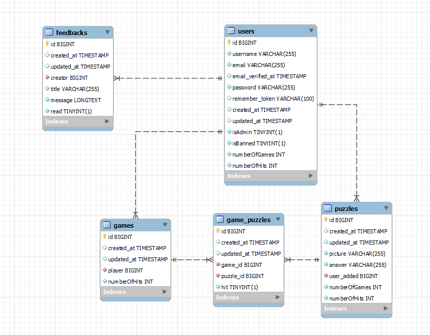

# Rendszerterv
## 1. A rendszer célja

Egy olyan web alapú alkalmazás létrehozása Laravel keretrendszer segítségével, ahol a felhasználók időtöltés és új ismeretek szerzésének céljából egy olyan játékot játszhatnak, ahol egy képről kell eldönteni, hogy honnan, miből származik. Lehet regisztráció nélkül és regisztrációval is játszani. A regisztrált felhasználók statisztikát kapnak eredményeikről, illetve elérhető egy globális statisztika is. A felhasználó fiók készítéséhez megadnak jelszót, e-mail címet, felhasználónevet, illetve profilképet is feltölthetnek, de ez opcionális. A weboldal adminisztrátorai képesek új feladványokat feltölteni a rendszerbe, illetve szükség szerűen törölni azokat. Az adminisztrátorok igény szerint törölhetik a szabályoknak nem megfelelő fiókokat, vagy előléptethetik őket adminisztrátorokká.

## 2. Projektterv

PHP, HTML, CSS, JavaScript használatával, Laravel keretrendszerben webalkalmazás létrehozása.

### 2.1 Projektszerepkörök, felelőségek:
   * Scrum masters: Banyik Nándor, Matuch Richárd
   * Product owner: Matuch Richárd
   * Üzleti szereplő: Banyik Nándor
     
### 2.2 Projektmunkások és felelőségek:
   * Frontend: Györkis Tamás, Karácsony Balázs, Kovács Dávid
   * Backend: Györkis Tamás, Karácsony Balázs, Kovács Dávid
   * Tesztelés: Györkis Tamás, Karácsony Balázs, Kovács Dávid
     
### 2.3 Ütemterv:

| Funkció | Feladat | Prioritás | Becslés (nap) | Aktuális becslés (nap) | Eltelt idő (nap) | Becsült idő (nap) |
|-----|--------|-------|------|-------------|------------|-----------------|
| Követelmény specifikáció | Megírás | 1 | 1 | 1 | 1 | 1 |             
| Funkcionális specifikáció | Megírás | 1 | 1 | 1 | 1 | 1 |
| Rendszerterv | Megírás | 1 | 1 | 1 | 1 | 1 |
| Program |Képernyőtervek elkészítése | 2 | 1 | 1 | 1 | 1 |
| Program |Prototípus elkészítése | 3 | 10 | 10 | 10 | 10 |
| Program |Alapfunkciók elkészítése | 3 | 10 | 10 | 10 | 10 |
| Program |Tesztelés | 4 | 3 | 3 | 3 | 3 |

### 2.4 Mérföldkövek:
- Feladatok elosztása
- Dokumentáció elkészítése
- Alfa teszt
- Béta teszt
- Prototípus átadása
- Végleges program átadása

## 3. Üzleti folyamatok modellje

### 3.1 Üzleti szereplők

- Látogatók (Felhasználó fiókkal nem rendelkező szereplők)
- Felhasználók
- Adminisztrátorok

### 3.2 Üzleti folyamatok

## 4. Követelmények

### 4.1 Funkcionális követelmények

| ID | Megnevezés | Leírás |
| --- | --- | --- |
| K1 | Bejelentkezés | Bejelentkező felület felhasználók, adminisztrátorok számára |
| K2 | Regisztráció | Regisztrációs felület látogatóknak |
| K3 | Új játék indítása | Új játék indítására és lejátszására szolgáló oldal |
| K4 | Saját profil megtekintése | Saját adatok és statisztikák megtekintése, személyes adatok szerkesztése |
| K5 | Feladványok megtekintése | Adminisztrátorok számára feladványok listázása, azok törlése |
| K6 | Új feladvány feltöltése | Adminisztrátorok számára új feladványok feltöltése |
| K7 | Visszajelzés | Felhasználók számára visszajelzés írása, adminisztrátorok számára ezek megtekintése |
| K8 | Felhasználók megtekintése | Adminisztrátorok számára felhasználók megtekintése, keresése, lehetőség a felhasználók kitiltására, adminisztrátorrá való előléptetésére |

### 4.2 Nemfunkcionális követelmények

| ID | Megnevezés | Leírás |
| --- | --- | --- |
| K9 | Jogosultság kezelés | Látogató, felhasználó és adminisztrátor megkülönböztetése |
| K10 | Felhasználó kezelés | Felhasználói fiók létrehozása, adatok tárolása |
| K11 | Modern felület | Mai kornak elvárt modern, könnyen navigálható felület |

### 4.3 Támogatott eszközök
Modern (pl.: Google Chrome, Firefox, Safari), vagy beépített webböngészővel, illetve interneteléréssel rendelkező eszközök összessége.

## 5. Funkcionális terv

### 5.1 Rendszerszereplők
- Látogató
  - Tud játékot indítani, de a statisztikája nem mentődik el.
- Felhasználó
   - Játékot indít, szerkeszti a profilját, visszajelzést hagy.
- Adminisztrátor
  - Rendelkezik a felhasználó jogaival, és új feladványt visz fel vagy töröl, felhasználókat tilt ki, vagy léptet adminisztrátorrá.

### 5.2 Menühierarchiák
1. Főoldal
2. Új játék indítása
3. Profil megtekintése
   *  Profil szerkesztése
4. Feladványok kilistázása
   * Új feladvány feltöltése
5. Felhasználók kilistázása
6. Bejelentkezés
7. Regisztráció
8. Kijelentkezés

## 6. Fizikai környezet

Laravel által szolgáltatott fejlesztői webszerver fejlesztés során, a kész projekt esetén tényleges webszerver.

### 6.1 Hardver topológia

- Szerver weboldal kiszolgáló funkciókkal és szerver adatbázis kiszolgálóval.
- Vagy egy szerver webszerver és adatbázis szerver funkciókkal.

### 6.2 Fejlesztő eszközök
- Programozási nyelvek, leírónyelvek, keretrendszerek: Laravel, PHP, HTML, CSS, JavaScript, BootStrap
- Adatbázis kezelő programok: PHPMyAdmin, MySql Workbench
- Fejlesztői környezetek: Visual Studio Code, PHPStorm, Vim
- Tesztelési környezet: Webböngésző programok (Pl.: Google Chrome, Firefox, Microsoft Edge), illetve ezek beépített fejlesztői eszközei.

## 7. Architekturális terv

### 7.1 Webszerver

Apache webszerver, IIS webszerver, Laravel által nyújtott fejelsztői webszerver

### 7.2 Adatbázis rendszer

MySql relációs adatbázis

## 8. Adatbázis terv

## 9. Implementációs terv
A weboldal elkészítéséhez Laravel keretrendszert használunk. Az adatbázist Laravel-ben migrációkkal készítjük el. Az alkalmazás egyes elemei (nézetek, publikus fájlok, modellek, stb.) külön mappákban találhatóak. A dokumentáció, illetve a weboldalon megjelenő szövegektől eltekintve törekszünk az angol nyelv használatára. Szükség esetén JavaScript-et is alkalmazunk az egyes elemeknél.

## 10. Telepítési terv

Az alkalmazás telepítéséhez szükséges egy webkiszolgáló. Ez Windows rendszeren lehet xampp (ami Apache szervert és MySql szervert foglal magába.), illetve linuxos rendszereken közvetlen lehet Apache és MySql szerver. Az alkalmazás fájljait be kell másolni a webszerver oldalak számára fent tartott mappájába, és megadni a .env fájlban a adatbázis szerver elérhetőségeit (Cím, felhasználó, jelszó, adatbázis). Ezeket a felhasználókat, adatbázisokat létre kell hozni az adatbázis szerveren is. Ezután migrálni kell az adatbázisba a táblákat, és azok tartalmait. Ezután az üzemeltető által választott címen elérhető a weboldal.

## 11. Karbantartási terv

- A projekt átadása után jelzett hibák (akár felhasználók, akár megrendelők által jelzett) javítása igényszerűen.
- 6 havonta Laravel keretrendszer frissítése és egyes komponensek frissítése ezzel együtt.